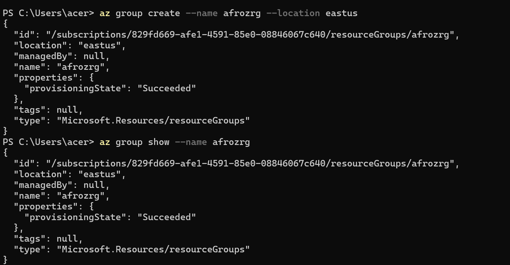
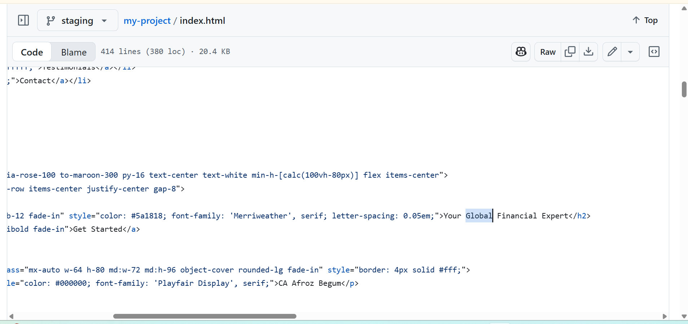
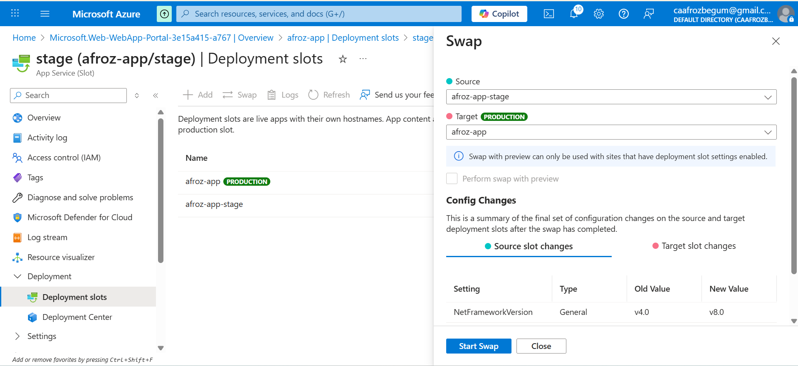
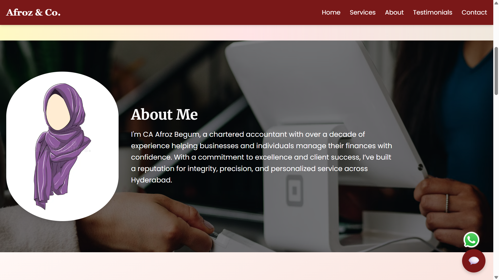
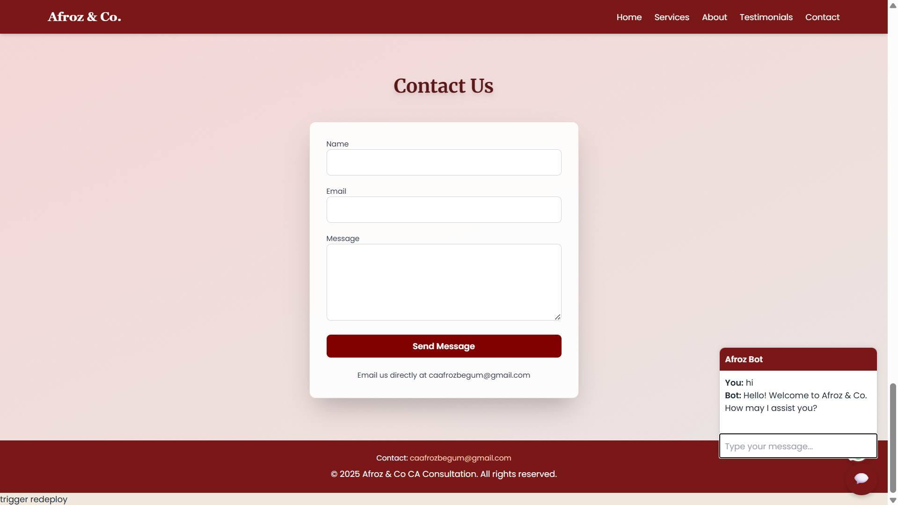

## Deploying a Static Website on Azure App Service with Deployment Slots.

This project demonstrates deploying a static website using **Azure App Service** with **GitHub** integration and **deployment slots** for seamless updates via a CI/CD pipeline. This README explains Azure App Service, deployment slots, and provides a detailed guide to deploy the website and swap slots.

> ## Table of Contents
> - [Azure App Service Overview](#azure-app-service-overview)
> - [Deployment Slots Overview](#deployment-slots-overview)
> - [Prerequisites](#prerequisites)
> - [Deployment Steps](#deployment-steps)
>   - [1. Create a Resource Group](#1-create-a-resource-group)
>   - [2. Create an App Service Plan](#2-create-an-app-service-plan)
>   - [3. Create a Web App](#3-create-a-web-app)
>   - [4. Set Up a GitHub Repository](#4-set-up-a-github-repository)
>   - [5. Push Website Code to GitHub](#5-push-website-code-to-github)
>   - [6. Configure CI/CD with GitHub](#6-configure-cicd-with-github)
>   - [7. Create a Staging Deployment Slot](#7-create-a-staging-deployment-slot)
>   - [8. Deploy to Staging Slot](#8-deploy-to-staging-slot)
>   - [9. Swap Staging with Production](#9-swap-staging-with-production)
>   - [10. Verify Deployment](#10-verify-deployment)
> - [Peek at deployed site](#peek)
> - [Conclusion](#conclusion)

## Azure App Service Overview
**Azure App Service** is a managed platform-as-a-service (PaaS) by Microsoft Azure for hosting web applications, including static websites (HTML, CSS, JavaScript). It handles infrastructure tasks like server management, scaling, and security, allowing developers to focus on code. It supports multiple languages and integrates with GitHub for automated deployments.

## Deployment Slots Overview
**Deployment Slots** are isolated environments within an Azure App Service instance, enabling you to deploy and test different versions of your app (e.g., staging, production). Each slot has a unique URL and settings, allowing you to validate changes in staging before swapping to production with zero downtime.

## Prerequisites
- **Azure Account**: Active subscription (free trial available at [azure.microsoft.com](https://azure.microsoft.com)).
- **GitHub Account**: For hosting your website code.
- **Git**: Installed locally for version control.
- **Static Website Files**: HTML, CSS, JavaScript files ready for deployment.
- **Azure CLI** (optional): For CLI-based management ([install guide](https://learn.microsoft.com/en-us/cli/azure/install-azure-cli)).
- **Code Editor**: E.g., Visual Studio Code.

## Deployment Steps


### 1. Create a Resource Group with Azure CLI
A resource group organizes Azure resources.

1. Open a terminal (e.g., Command Prompt, PowerShell, or Bash).
2. Log in to Azure CLI:
   ```bash
   az login
   ```
 >**AZ LOGIN SCREENSHOT**
   - 
   Follow the browser prompt to authenticate.

3. Create a resource group:
   ```bash
   az group create --name afrozrg --location eastus
   ```
 >**AZ GROUP CREATE & SHOW SCREENSHOT**
   - 
     
   - Replace `eastus` with your preferred region (e.g., `westus`, `centralus`).
   
4. Verify the resource group exists:
   - Option 1: Check in the Azure Portal under **Resource Groups**.
   - Option 2: Run the following command:
     ```bash
     az group show --name afrozrg
     ```
  >**AZ RESOURCE GROUP CHECK IN PORTAL SCREENSHOT**
   - 


### 2. Create a Web App
Host your static website.

1. In Azure Portal, search for **App Services**.
2. Click **+ Create** > **Web App**.
3. Configure:
   - **Subscription**: Your subscription.
   - **Resource Group**: `afrozrg`.
   - **Name**: `afroz-app` (must be unique).
   - **Publish**: Code.
   - **Runtime Stack**: .NET 9 .
   - **OS**: windows.
   - **Region**: Same as above.
   - **App Service Plan**: `(new)afroz-asp`.
4. Click **Review + Create**, then **Create**.
5. Note the **Default Domain** (e.g., `https://afroz-app.azurewebsites.net`).
   
>**AZ WEBAPP CREATION** 
  - 

>**AZ WEBAPP CREATED**
  - 

>**AZ WEBAPP PAGE**
  - 

>**AZ WEBAPP BROWSE PAGE**
  - 

  
### 3. Set Up a GitHub Repository
Host your code on GitHub.

1. Log in to [GitHub](https://github.com).
2. Click **+ New Repository**.
3. Configure:
   - **Name**: `my-project`.
   - **Visibility**: Public or Private.
   - **Initialize with README**: Optional.
4. Click **Create Repository**.

>**GIT REPOSITORY CREATION**
  - 

>**GIT REPOSITORY CREATED**
  - 

### 4. Push Website Code to GitHub
Upload your static website files.

1. Open your project folder in a code editor.
2. Initialize Git and push code:
   ```bash
   git remote add origin https://github.com/Afroz-CA/my-project.git
   git branch -M main
   git push -u origin main
   ```
3. Verify files in GitHub repository.

>**UPLOAD FILES IN GIT**
  - 
     
>**UPLOADED FILES IN GIT**
   - 

### 5. Configure CI/CD with GitHub
Automate deployment to Azure.

1. In Azure Portal, go to your web app’s **Deployment Center**.
2. Select **Source**: External Git.
3. Configure:
   - **Repository**: `https://github.com/Afroz-CA/my-project.git`.
   - **Branch**: `main`.
   - **Repository type**: `public`
5. Click **Save** to create a GitHub Actions workflow.
6. Check the **Actions** tab in GitHub for workflow status.
7. Verify the site at the **Default Domain** URL.

>**DEPLOYMENT CENTER**
- 
  
>**PRODUCTION BROWSE PAGE**
- 

### 6. Create a Staging Deployment Slot
Test updates in a separate environment.

1. In your web app, go to **Deployment Slots**.
2. Upgrade : **S1**
3. Click **+ Add Slot**.
4. Enter:
   - **Name**: `stage`.
   - **Clone Settings**: Optional (clone from production).
5. Click **Add**.
6. Note the staging URL (e.g., `https://afroz-app-stage.azurewebsites.net`).

>**UPGRADE**
  - 
      
>**UPGRADE TO S1**
   - 

>**ADD DEPLOYMENT SLOT - STAGE**
   - 


### 7. Deploy to Staging Slot
Deploy updates to the staging slot.

1. In GitHub, create a `staging` branch.
2. Make slight changes in index.html file like **hyderabad - global** 
3. In Azure Portal, go to the **stage** slot’s **Deployment Center**.
4. Configure to use the `stage` branch (as in Step 6).
   . Select **Source**: External Git.
    .Configure:
     - **Repository**: `https://github.com/Afroz-CA/my-project.git`.
     - **Branch**: `staging`.
     - **Repository type**: `public`
    . Click **Save** to create a GitHub Actions workflow.
    . Check the **Actions** tab in GitHub for workflow status.
5. Verify changes at the staging URL.

>**CREATING STAGE BRANCH IN GIT**
- 

 >**MAKING CHANGES IN index.html file**
 - 
  
>**DEPLOYMENT CENTER OF STAGE**
- 

>**STAGE GIT CODE DEPLOYING**
- 
  
>**STAGE BROWSE PAGE**
- 

### 8. Swap Staging with Production
Promote staging changes to production.

1. In **Deployment Slots**, select the **staging** slot.
2. Click **Swap**.
3. Configure:
   - **Source**: `staging`.
   - **Destination**: `Production`.
   - **Swap Type**: Swap.
4. Click **Swap**.

>**SWAP**
- 

### 9. Verify Deployment
Ensure production reflects staging changes.

1. Visit the production URL (e.g., `https://my-static-web-app.azurewebsites.net`).
2. Confirm updated content displays.
3. Check GitHub Actions logs for deployment status.

>**PRODUCTION BROWSE PAGE after swap**
- 

  
>**STAGE BROWSE PAGE after swap**
- 

>  ### ```A Peek at the Azure-Deployed Site```
> 
> Here are some screenshots of the site I rolled out using Azure App Services! They offer a quick look at the app’s style and flow, highlighting its design and how it performs in the real world. Just a fun way to show off the project!
> 
>  > **Website Home Page**
>    - 
>      
>  > **About Me Section**
>    - 
>      
>  > **Our Expertise Section**
>    - 
>      
>  > **About Our Services Section**
>    - 
>      
>  > **Client Success Stories Section**
>    - 
>      
>  > **Contact Us Section**
>    - 


### Conclusion
You’ve deployed a static website to Azure App Service with GitHub CI/CD and used deployment slots for zero-downtime updates. This setup enables efficient testing and deployment. Explore further Azure features like custom domains or scaling for advanced use cases.

**Resources**:
- [Azure App Service Docs](https://learn.microsoft.com/en-us/azure/app-service/)
- [GitHub Actions Docs](https://docs.github.com/en/actions)
```

